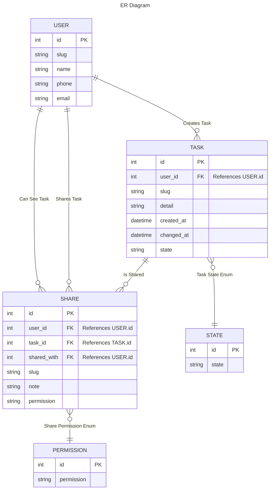

# vbsays-fastapi-lambda
A repo for learners to understand how they can run FastAPI applications on a pay as you use mode.

## FastAPI 

### Setup

Create a virtual environment with needed packages.

_I am using python 3.10 on a Mac and hence the code below but you can easily change that._

```
virtualenv -p python3.10 env
source ./env/bin/activate
pip install "fastapi[all]" uvicorn
```

### Basic

Create a basic FastAPI and run it.

**main.py** create
```
from fastapi import FastAPI

app = FastAPI()

@app.get("/")
async def json_output():
  return {"output": "FastAPI is working"}

# End of File
```

Run API using
```
uvicorn main:app --reload
```

Open in your browser [http://127.0.0.1:8000/](http://127.0.0.1:8000/)

### Route

Add another route to the FastAPI and run it. 
**main.py** edit
```
from fastapi import FastAPI

app = FastAPI()

@app.get("/")
async def json_output():
  return {"output": "FastAPI is working"}

@app.get("/route")
async def route():
    return {"output": "Another FastAPI route"}

# End of File
```

Run API using
```
uvicorn main:app --reload
```

### Advanced

Let's Structure this for more advanced projects. 
Creating an example crud application with 3 entities User, Task and Share.


We will need more packages
```
pip install pydantic sqlalchemy

```

### Final for this example
### Run on Local
